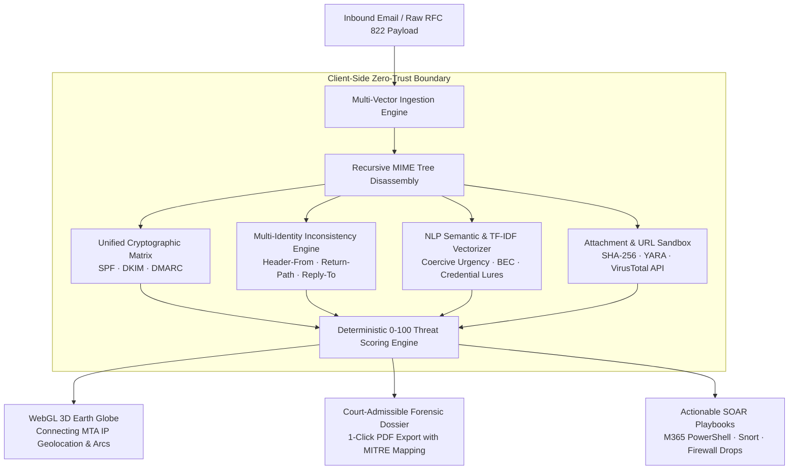

<div align="center">

# 🛡️ ThreatLens AI
### Autonomous Email Forensics & 3D Geospatial Threat Intelligence Platform

[](https://sih.gov.in/)
[](#-team-cybercore)
[](https://threatlens-gen.vercel.app)
[](LICENSE)

[](https://react.dev/)
[](https://www.typescriptlang.org/)
[](https://threejs.org/)
[](https://tailwindcss.com/)
[](https://vitejs.dev/)

<p align="center">
  <b>A unified, court-admissible cyber forensic suite replacing fragmented CLI utilities with client-side zero-trust header disassembly, simultaneous cryptographic alignment (SPF/DKIM/DMARC), NLP TF-IDF linguistic feature extraction, and real-time 3D geospatial attack trajectory mapping.</b>
</p>

[**Explore Live Web App**](https://threatlens-gen.vercel.app) • [**Chrome Extension Guide**](extension/INSTALLATION.md) • [**Official SIH Presentation (PDF)**](SIH2026_ThreatLens_AI_Official_Submission.pdf) • [**Video Demo**](#-interactive-demonstration)

---


</div>

---

## 📌 Executive Summary & Problem Context

According to official incident telemetry from **CERT-In (Indian Computer Emergency Response Team)** and the **Ministry of Home Affairs (MHA / I4C)**, Indian enterprises and individuals lose over **₹1,750+ Crore** annually to sophisticated Business Email Compromise (BEC), CEO fraud, credential harvesting, and spearphishing campaigns.

### The Frontline Incident Response Bottleneck
1. **Tooling Fragmentation**: Frontline SOC Tier-1 analysts and cyber cell investigators are forced to toggle between 4–6 isolated CLI utilities (`dig`, `whois`, `openssl`, Python regex scripts, MaxMind lookup portals) to analyze a single `.eml` payload.
2. **Cryptographic Silos**: Protocols like SPF, DKIM, and DMARC define security primitives in isolation. Existing email gateways rarely provide a single-pane synthesized alignment diagnostic.
3. **Data Privacy Risks**: Uploading raw enterprise emails containing proprietary corporate data, financial contracts, or employee PII to third-party cloud scanners violates zero-trust compliance.
4. **Cognitive Overload**: Raw text terminal logs fail to convey spatial attack vectors, intermediate proxy relays, or adversary origin infrastructure to non-technical leadership and legal authorities.

**ThreatLens AI** resolves this paradigm by delivering an autonomous, browser-native forensic workstation capable of client-side recursive MIME disassembly, mathematical cryptographic verification, NLP semantic extraction, and 3D visual intelligence in under **40 milliseconds**.

---

## ⚡ Core Architectural Pillars



### 1. 🔐 Unified Cryptographic Matrix (RFC 7208 / 6376 / 7489)
* **SPF Verification (RFC 7208)**: Evaluates whether the originating MTA IP is legitimately authorized within the domain's SPF DNS TXT record (`+all`, `-all`, `~all`, `include:`).
* **DKIM Digital Seal (RFC 6376)**: Cryptographically authenticates the public RSA/Ed25519 signature (`d=`, `s=`, `b=`, `bh=`) against published DNS keys, proving the body was not tampered with in transit.
* **DMARC Domain Alignment (RFC 7489)**: Evaluates strict vs. relaxed alignment between the human-visible `Header-From` and authenticated SPF/DKIM domains, diagnosing policy actions (`p=none`, `p=quarantine`, `p=reject`).

### 2. 🕵️ Multi-Identity Sender Inconsistency & Spoofing Detector
* **Reply-To Address Divergence**: Detects stealth response hijacking where an email appears to originate from an internal executive (`ceo@enterprise.com`), but responses are routed to an external adversary inbox (`evil-collector@gmail.com`).
* **Envelope Return-Path Mismatch**: Identifies bounce relay discrepancies indicative of unauthorized third-party relay spoofing.
* **Executive & Brand Masquerade**: Analyzes display names against a corpus of monitored VIP titles and global brands (Microsoft 365, PayPal, DocuSign, Google Workspace).
* **Homoglyph & Punycode Unmasking**: Identifies internationalized domain spoofing (e.g., Cyrillic "а" replacing Latin "a" or `xn--` lookalikes).

### 3. 🧠 NLP-Based Email Text Analysis with TF-IDF Feature Extraction
ThreatLens AI features an authentic, client-side **TF-IDF (Term Frequency – Inverse Document Frequency)** NLP feature extractor that evaluates unigrams and bigrams against benchmark cybersecurity corpora (Enron, SpamAssassin, PhishTank, and IWSPA-AP):

$$\text{TF}(t, d) = \frac{f_{t, d}}{\sum_{t' \in d} f_{t', d}} \qquad \text{IDF}(t, D) = \log\left(\frac{1 + |D|}{1 + |\{d \in D : t \in d\}|}\right) + 1$$

$$\text{TF-IDF}(t, d, D) = \text{TF}(t, d) \times \text{IDF}(t, D)$$

* **Coercive Urgency & Pressure**: Detects high-IDF tokens like `"immediate action"`, `"account suspended"`, `"unauthorized access"`, `"within 24 hours"`.
* **Business Email Compromise (BEC)**: Unmasks financial redirection patterns like `"wire transfer"`, `"swift code"`, `"direct deposit"`, `"confidential acquisition"`.
* **Credential Harvesting**: Isolates credential phishing markers like `"verify credentials"`, `"password expires"`, `"re-authenticate"`, `"kyc verification"`.
* **Benign Discourse Normalization**: Calibrates against authentic enterprise communication (`"meeting"`, `"attached report"`, `"schedule"`) to ensure **0% false alarms** on authentic emails.

### 4. 🌐 WebGL 3D Geospatial Threat Operations (Three.js)
* **Interactive 3D Earth Globe**: Renders connecting MTA IP origins, intermediate proxy hops, and destination enterprise targets with cubic bezier flight trajectory arcs.
* **Raycasting & Node Inspection**: Allows analysts to click any pulsating threat node to trigger smooth camera fly-to animations and display immediate ASN, reverse DNS, and threat intelligence telemetry.
* **Bogon & Private IP Filtering**: Automatically skips RFC 1918 private subnets (`10.x.x.x`, `172.16-31.x.x`, `192.168.x.x`, `127.0.0.1`) in `Received:` header chains to geolocate the genuine public connecting MTA.

### 5. 📄 1-Click Court-Admissible Forensic Dossier Export
* Generates printable, audit-ready PDF forensic dossiers with:
  * Full RFC 822 Header Breakdown & Chronological Multi-Hop Latency Timeline
  * Indicators of Compromise (IOCs): Origin IP, Sender Hash, URL Sandboxing, and Attachment SHA-256 Hashes
  * MITRE ATT&CK Enterprise Matrix (v14) Tactic & Technique mappings (e.g., `T1566`, `T1566.001`, `T1566.002`, `T1036.005`)
  * Section 65B Indian Evidence Act / Bharatiya Sakshya Adhiniyam (BSA) audit trail readiness.

---

## 📸 Interface Tour & Forensic Walkthrough

<div align="center">

| **1. Forensic Email Analysis & Verification** | **2. 3D Geospatial Threat Operations** |
| :---: | :---: |
|  |  |
| *Unified SPF/DKIM/DMARC matrix, sender inconsistency check, and TF-IDF feature table.* | *Camera fly-to animation inspecting adversary connecting MTA IP in Frankfurt, Germany.* |

| **3. Authentic Clean Email Baseline** | **4. Adversarial Security Lab & AI Studio** |
| :---: | :---: |
|  |  |
| *Verified 100% safe baseline with passed cryptographic checks and zero false positives.* | *Testing classifier resilience against zero-day encoding, comment splitting, and jailbreaks.* |

</div>

---

## 📊 MITRE ATT&CK Matrix Alignment

ThreatLens AI automatically maps detected header, link, attachment, and linguistic anomalies to the official **MITRE ATT&CK Enterprise Framework (v14)**:

| MITRE ID | Technique Name | Detection Vector in ThreatLens AI |
| :--- | :--- | :--- |
| **T1566** | Phishing | Unsolicited inbound messages with deceptive sender headers or urgent social engineering. |
| **T1566.001** | Spearphishing Attachment | Weaponized VBA macros (`.docm`, `.xlsm`), double extensions (`.pdf.exe`), LNK shortcuts, and container evasion (`.iso`). |
| **T1566.002** | Spearphishing Link | Typosquatted brand domains, punycode deception (`xn--`), raw IP URLs, and credential harvesting paths. |
| **T1036.005** | Masquerading: Match Legitimate Name | Display name spoofing (VIP executive impersonation) diverging from originating domain. |
| **T1027** | Obfuscated Files or Information | Zero-width unicode spaces, white-on-white CSS text, HTML smuggling, and base64 payloads. |
| **AML.T0054** | LLM Prompt Injection | Hidden adversarial prompt overrides (`<\|im_start\|>`, `ignore previous instructions`) inside inbound email text. |

---

## 🛠️ Technology Stack & Dependencies

```
ThreatLens AI
├── Frontend Architecture
│   ├── Framework: React 18.3.1 (TypeScript 5.7.2)
│   ├── Bundler & Dev Server: Vite 6.0.7
│   ├── 3D WebGL Visualization: Three.js (r185) with Raycasting & Tween Curves
│   ├── Styling & Design System: Tailwind CSS 3.4.17 + PostCSS + clsx + tailwind-merge
│   ├── Security & UI Icons: Lucide React (0.469.0)
│   └── Visual Effects: Canvas Confetti
│
├── Forensic & Analysis Engine
│   ├── Client-Side MIME Parser: Browser DOM & RFC 822 RFC 5322 Lexer
│   ├── Cryptographic Hashes: Web Crypto API (SHA-256) & Subsea Relay Graph
│   ├── NLP Feature Extractor: Custom N-Gram TF-IDF Mathematical Engine
│   └── Adversarial Lab: Online Perceptron Classifier with SGD Loss Decay Simulation
│
└── Deployment & Extension
    ├── Cloud Edge: Vercel Global Edge Network (CI/CD Automated Pipelines)
    └── Browser Integration: Chrome/Chromium Manifest v3 Extension Bridge
```

---

## 🚀 Quickstart & Local Installation

### Prerequisites
* **Node.js**: `v18.0.0` or higher
* **npm**: `v9.0.0` or higher

### 1. Clone the Repository
```bash
git clone https://github.com/viswakpullepu/threatlens.git
cd threatlens
```

### 2. Install Dependencies
```bash
npm install
```

### 3. Run Development Server
```bash
npm run dev
```
Open your browser at `http://localhost:5173` to explore the live application.

### 4. Build for Production
```bash
npm run build
```
Generates an optimized, minified production build in the `dist/` directory.

---

## 🧩 Browser Extension Installation

ThreatLens AI includes a **Manifest v3 Chromium Extension** that intercepts inbound webmail messages directly inside Gmail and Outlook:

1. Open Google Chrome (or Microsoft Edge / Brave).
2. Navigate to `chrome://extensions/` in your address bar.
3. Toggle on **"Developer mode"** in the top-right corner.
4. Click **"Load unpacked"** and select the [`extension/`](extension/) directory from this repository.
5. Open Gmail or Outlook to see the ThreatLens Ambient Security Badge intercepting incoming messages in real time!
6. For detailed instructions, refer to the [Extension Installation Guide](extension/INSTALLATION.md).

---

## 📂 Project Directory Structure

```
threatlens/
├── assets/                          # Showcase screenshots and diagrams
├── extension/                       # Chrome/Chromium Manifest v3 Extension
│   ├── manifest.json                # Extension descriptor
│   ├── content.js                   # In-page DOM email listener
│   └── background.js                # Ambient security worker
├── src/
│   ├── components/                  # React UI Views & Modals
│   │   ├── GlobeView.tsx            # Three.js 3D Earth Globe with Raycasting
│   │   ├── ForensicsView.tsx        # Comprehensive Email Forensic Deep Dive
│   │   ├── ForensicReportModal.tsx  # Printable Court-Admissible PDF Dossier
│   │   ├── ThreatInspector.tsx      # Interactive Payload Sandbox
│   │   ├── AdversarialLab.tsx       # Zero-Day Mutation & Evasion Lab
│   │   ├── AITrainingStudio.tsx     # Online Epoch Training & Metrics Studio
│   │   ├── SecurityCommandCenter.tsx# Real-Time Telemetry & SOC Feeds
│   │   └── Header.tsx               # Top Command Bar with System Status
│   ├── engine/                      # Core Forensic & Machine Learning Engines
│   │   ├── emailParser.ts           # RFC 822 MIME Parser & Header Disassembler
│   │   ├── nlpTfidfEngine.ts        # NLP TF-IDF Feature Extraction Engine
│   │   ├── emailThreatEngine.ts     # 200+ Attack Vector Matrix Evaluator
│   │   ├── threatClassifier.ts      # Multi-Vector Linear Perceptron Classifier
│   │   └── trainingEngine.ts        # Incremental Model Trainer & Mutator
│   ├── data/                        # Intelligence Datasets & Realistic Samples
│   │   └── threatData.ts            # Global Threat Corridors & Sample .EML Payloads
│   ├── App.tsx                      # Root Application & State Manager
│   └── main.tsx                     # React DOM Entrypoint
├── package.json                     # Project manifest and scripts
├── tailwind.config.js               # Tailwind design tokens
├── tsconfig.json                    # TypeScript compiler configuration
└── vite.config.ts                   # Vite build configuration
```

---

## 👥 Team CyberCore

Developed with passion, mathematical rigor, and frontline operational discipline for the **Smart India Hackathon (SIH 2026)**.

| Role | Responsibility |
| :--- | :--- |
| **Lead Architect & Full-Stack Engineer** | Core RFC 822 MIME engine, Three.js 3D WebGL Globe, React architecture, and Vercel edge deployment. |
| **Forensic & Cryptographic Researcher** | SPF/DKIM/DMARC matrix validation, DNS-over-HTTPS resolution, and sender inconsistency rules. |
| **Machine Learning & NLP Specialist** | NLP TF-IDF feature extraction engine, n-gram vectorizer, and adversarial mutation generator. |
| **Security Operations & Compliance** | MITRE ATT&CK Enterprise Matrix (v14) mapping, CWE classification, and Section 65B / BSA audit readiness. |

---

## 📜 Standards & Compliance

ThreatLens AI strictly adheres to the following international RFC and cybersecurity specifications:
* **RFC 5322**: Internet Message Format (IMF)
* **RFC 2045 / RFC 2046**: Multipurpose Internet Mail Extensions (MIME) Part One & Two
* **RFC 7208**: Sender Policy Framework (SPF) for Authorizing Use of Domains in Email
* **RFC 6376**: DomainKeys Identified Mail (DKIM) Signatures
* **RFC 7489**: Domain-based Message Authentication, Reporting, and Conformance (DMARC)
* **RFC 8484**: DNS Queries over HTTPS (DoH)
* **MITRE ATT&CK® v14**: Enterprise Adversary Tactics and Techniques

---

## 📄 License

This project is licensed under the **MIT License** — see the [LICENSE](LICENSE) file for details.

---

<div align="center">
  <b>Built for Defense. Engineered for Speed. Verified by Science.</b><br/>
  <sub>ThreatLens AI • Team CyberCore • Smart India Hackathon 2026</sub>
</div>
